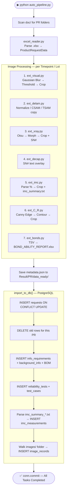
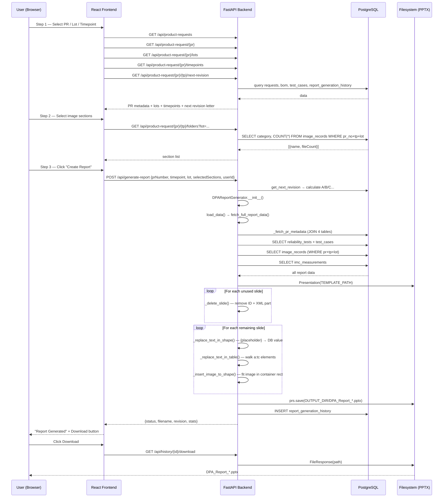
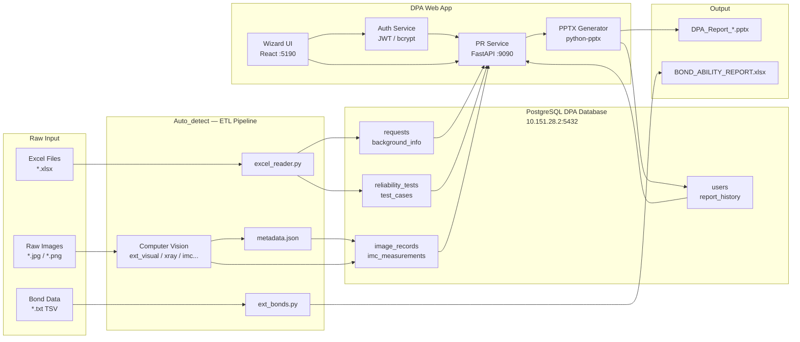
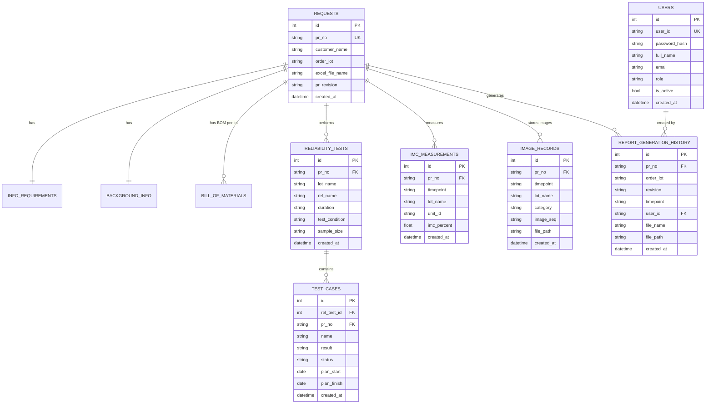

# DPA System — Architecture Overview

> **Two-project system:** `D:\Auto_detect` (ETL Pipeline) feeds data into PostgreSQL,
> then `D:\DPA` (Web App) reads that data and generates PPTX reports.

---

## 1. High-Level Architecture

```
┌─────────────────────────────────────────────────────────┐
│                 SHARED INFRASTRUCTURE                   │
│                                                         │
│  NAS / Filesystem           PostgreSQL 15               │
│  ────────────────           ─────────────               │
│  doc/{PR}/                  10.151.28.2:5432/DPA        │
│   ├── *.xlsx                • requests                  │
│   ├── T0/                   • info_requirements         │
│   │   └── {LOT}/            • background_info           │
│   │        ├── 1.EXT_VIS/   • BOM / users               │
│   │        ├── 2.DELAM/     • reliability_tests         │
│   │        ├── 3.X-RAY/     • test_cases                │
│   │        ├── 4.DECAP/     • imc_measurements          │
│   │        ├── 5.IMC/       • image_records             │
│   │        ├── 6.C-R/                                   │
│   │        └── 7.BS/WP/SP/  Oracle DW                   │
│   └── ...                   ─────────                   │
│                             10.151.25.145:1521/BSM      │
│                             • PROMIS.BWIP_LOT           │
└─────────────────────────────────────────────────────────┘
        ▲                                    ▲
        │ raw files                          │ processed
        │                                    │
┌───────┴──────┐                     ┌───────┴──────┐
│ Auto_detect  │──────writes───────▶│ DPA Web App  │
│ ETL Pipeline │     to Postgres     │ FastAPI/React│
└──────────────┘                     └──────────────┘
```

---

## 2. Project A — Auto_detect (ETL Pipeline)

### 2.1 Component Overview

| Component | File | Responsibility |
| --- | --- | --- |
| **Pipeline Orchestrator** | `auto_pipeline.py` | Entry point, loops over all PRs |
| **Excel Reader** | `scripts/excel_reader.py` | Parses Reliability Report sheet (header, BOM, tests) |
| **Visual Extractor** | `scripts/ext_visual.py` | OpenCV: threshold + contour crop per chip |
| **Delamination** | `scripts/ext_delam.py` | Rename/normalize CSAM/TSAM images |
| **X-Ray Extractor** | `scripts/ext_xray.py` | OpenCV: Otsu + morphology + SN# label |
| **Decap Extractor** | `scripts/ext_decap.py` | OpenCV: overlay SN# serial text |
| **IMC Extractor** | `scripts/ext_imc.py` | Parse `%` from filename + contour crop; write `imc_summary.txt` |
| **C-R Extractor** | `scripts/ext_C_R.py` | OpenCV: Canny edge + largest contour crop |
| **Bonds Report** | `scripts/ext_bonds.py` | Read TSV files → generate BOND_ABILITY_REPORT.xlsx |
| **DB Connector** | `scripts/db_connector.py` | psycopg2 connection pool (min 1 / max 10) |
| **DB Reset** | `scripts/reset_db.py` | DROP / CREATE tables (dev utility) |
| **Schemas** | `models/schemas.py` | Pydantic models: ProductRequestData, BackgroundInfo, BOM, etc. |

### 2.2 Pipeline Execution Flow



### 2.3 Folder Structure Convention

```
doc/
└── PR2024001/
    └── T0/                          ← Timepoint
        └── MTDQS0906.1/             ← Lot
            ├── 1.EXTERNAL VISUAL/   → ext_visual.py
            ├── 2.DELAM/             → ext_delam.py
            ├── 3.X-RAY/             → ext_xray.py
            ├── 4.DECAP/             → ext_decap.py
            ├── 5.IMC/               → ext_imc.py  (+ 1-1-1=94.10%.jpg files)
            ├── 6.C-R/               → ext_C_R.py
            └── 7.BS,WP,SP/          → ext_bonds.py (*.txt TSV)

Result/
└── PR2024001/
    ├── data_ready/
    │   ├── metadata.json
    │   └── imc_summary_T0_MTDQS0906.1.txt
    └── images/
        └── T0/
            └── MTDQS0906.1/
                ├── 1.EXTERNAL VISUAL/  ← processed JPGs
                ├── 2.DELAM/
                └── ...
```

---

## 3. Project B — DPA Web Application

### 3.1 Component Overview

```
D:\DPA
├── backend/                    FastAPI application (port 9090)
│   ├── main.py                 App factory, CORS, router registration
│   ├── .env                    Environment config (DB creds, JWT secret, paths)
│   ├── routers/
│   │   ├── auth.py             /api/auth/* — login, logout, register, JWT cookie
│   │   └── product_request.py  /api/* — PRs, generation, history
│   ├── services/
│   │   ├── auth_service.py     bcrypt + python-jose JWT
│   │   ├── db_connector.py     psycopg2 connection pool (PostgreSQL + Oracle)
│   │   ├── product_request_service.py  All DB queries (read, list, history)
│   │   └── report_generator.py DPAReportGenerator — PPTX creation (python-pptx)
│   └── models/
│       └── schemas.py          Pydantic request/response models
│
└── frontend/                   React + Vite (port 5190)
    └── src/
        ├── api.js              fetch wrapper (httpOnly cookie, 401 guard)
        ├── App.jsx             Root: auth gate + page routing
        ├── LoginPage.jsx       Employee ID + password form
        ├── RegisterPage.jsx    New account form
        ├── Sidebar.jsx         Navigation (Dashboard / Create / History)
        ├── CreateReport.jsx    3-step wizard
        ├── HistoryPage.jsx     Table: download / delete reports
        └── Components.jsx      Btn, Card, TextInput, SelectDropdown, etc.
```

### 3.2 Authentication Flow

```mermaid
sequenceDiagram
    participant B as Browser
    participant V as Vite Proxy :5190
    participant API as FastAPI :9090
    participant DB as PostgreSQL

    B->>V: POST /api/auth/login {userId, password}
    V->>API: proxy →
    API->>DB: SELECT user WHERE user_id = ? AND is_active
    DB-->>API: {user_id, full_name, role, password_hash}
    API->>API: bcrypt.checkpw(password, hash)
    Note over API: if plain-text hash → upgrade to bcrypt
    API->>API: jwt.encode({sub, name, role, exp})
    API-->>V: 200 + Set-Cookie: dpa_token=JWT; HttpOnly; SameSite=Lax
    V-->>B: Set-Cookie forwarded
    B->>B: localStorage.setItem('dpa_user', {userId, fullName, role})
    Note over B: JWT stays in httpOnly cookie — JS cannot read it

    B->>V: GET /api/product-requests (cookie sent automatically)
    V->>API: proxy + cookie
    API->>API: get_current_user(): read cookie → jwt.decode
    API-->>B: 200 JSON data
```

### 3.3 Report Generation Flow (Main Feature)



### 3.4 API Endpoint Map

| Method | Path | Auth | Description |
| --- | --- | --- | --- |
| `POST` | `/api/auth/login` | — | Login → set httpOnly cookie |
| `POST` | `/api/auth/logout` | — | Clear cookie |
| `POST` | `/api/auth/register` | — | Create account |
| `GET` | `/api/stats` | ✅ | Dashboard counts |
| `GET` | `/api/product-requests` | ✅ | List all PRs |
| `GET` | `/api/product-request/{pr}` | ✅ | PR detail (metadata + tests) |
| `GET` | `/api/product-request/{pr}/lots` | ✅ | Lots with images |
| `GET` | `/api/product-request/{pr}/timepoints` | ✅ | Timepoints from test_cases |
| `GET` | `/api/product-request/{pr}/{tp}/folders` | ✅ | Image categories + count |
| `GET` | `/api/product-request/{pr}/{tp}/next-revision` | ✅ | Next revision letter |
| `POST` | `/api/generate-report` | ✅ | Generate PPTX + save history |
| `GET` | `/api/download-report?path=` | ✅ | Download (path-traversal protected) |
| `GET` | `/api/history` | ✅ | Report generation history |
| `GET` | `/api/history/{id}/download` | ✅ | Download by record ID |
| `DELETE` | `/api/history/{id}` | ✅ | Delete record + file |
| `GET` | `/health` | — | Liveness check |

---

## 4. Full System Data Flow



---

## 5. Database Schema (ERD)



---

## 6. Image Processing Algorithms

| Category | Script | Algorithm | Output |
| --- | --- | --- | --- |
| External Visual | `ext_visual.py` | Gaussian Blur → Fixed Threshold (100) → Fallback Otsu → Contour filter (area > 50k) → Bounding Rect crop | `{base}_Visual_{n}.jpg` |
| Delamination | `ext_delam.py` | Normalize filename (spaces → underscores) → copy | `{clean}_Delam.jpg` |
| X-Ray | `ext_xray.py` | Gaussian Blur → Otsu Threshold → Dilate + MORPH_CLOSE → Largest contour → Crop + SN# overlay | `{base}_X_ray.jpg` |
| Decapsulation | `ext_decap.py` | Overlay SN# text centered on image (font scale 10, thickness 20) | `{base}_Decap.jpg` |
| IMC | `ext_imc.py` | Round 1: parse `%` from filename → imc_data dict. Round 2: Binary thresh (150) → Contour hierarchy (child-count roughness) → Crop + padding 150px | `{base}_IMC.jpg` + `imc_summary.txt` |
| C-R | `ext_C_R.py` | Gaussian Blur → Canny Edge (10,50) → Dilate (7×7, iter=4) → Largest contour → Crop + padding 20px | `{base}_C_R.jpg` |
| Bonds BS/WP/SP | `ext_bonds.py` | Read TSV → pandas DataFrame → openpyxl → Fill template → MIN/MAX/AVE formulas + Pass/Fail | `BOND_ABILITY_REPORT.xlsx` |

---

## 7. Technology Stack

| Layer | Technology | Version |
| --- | --- | --- |
| **Frontend** | React + Vite | React 18 |
| **UI Components** | Custom (Components.jsx) + Radix UI + MUI | — |
| **Backend API** | FastAPI | — |
| **ASGI Server** | Uvicorn | — |
| **Authentication** | python-jose (JWT) + bcrypt + httpOnly Cookie | HS256 |
| **Database Driver** | psycopg2 (PostgreSQL) + oracledb (Oracle) | — |
| **Image Processing** | OpenCV (cv2) + NumPy | — |
| **Excel Parsing** | openpyxl + pandas | — |
| **PPTX Generation** | python-pptx | — |
| **Image Resizing** | Pillow (PIL) | — |
| **Data Validation** | Pydantic v2 | — |
| **Database** | PostgreSQL 15 | 10.151.28.2:5432 |
| **Oracle DW** | Oracle (PROMIS) | 10.151.25.145:1521 |

---

## 8. Deployment Topology

```
┌─────────────────────────────────────────────────┐
│  Developer / Operator Machine (Windows 11)       │
│                                                  │
│  ┌──────────────────┐   ┌──────────────────────┐ │
│  │  Auto_detect     │   │  DPA Web App          │ │
│  │  (CLI / batch)   │   │                       │ │
│  │                  │   │  vite dev :5190        │ │
│  │  python          │   │    proxy → :9090       │ │
│  │  auto_pipeline.py│   │                       │ │
│  │                  │   │  uvicorn :9090         │ │
│  └────────┬─────────┘   └──────────┬────────────┘ │
│           │  writes                │ reads         │
└───────────┼────────────────────────┼───────────────┘
            │                        │
            ▼                        ▼
   ┌─────────────────────────────────────────┐
   │  PostgreSQL 15 @ 10.151.28.2:5432/DPA   │
   └─────────────────────────────────────────┘
                        ▲
                        │  (optional lot lookup)
   ┌─────────────────────────────────────────┐
   │  Oracle DW @ 10.151.25.145:1521/BSM     │
   │  PROMIS.BWIP_LOT                        │
   └─────────────────────────────────────────┘
```

---

*Generated: 2026-04-27*
